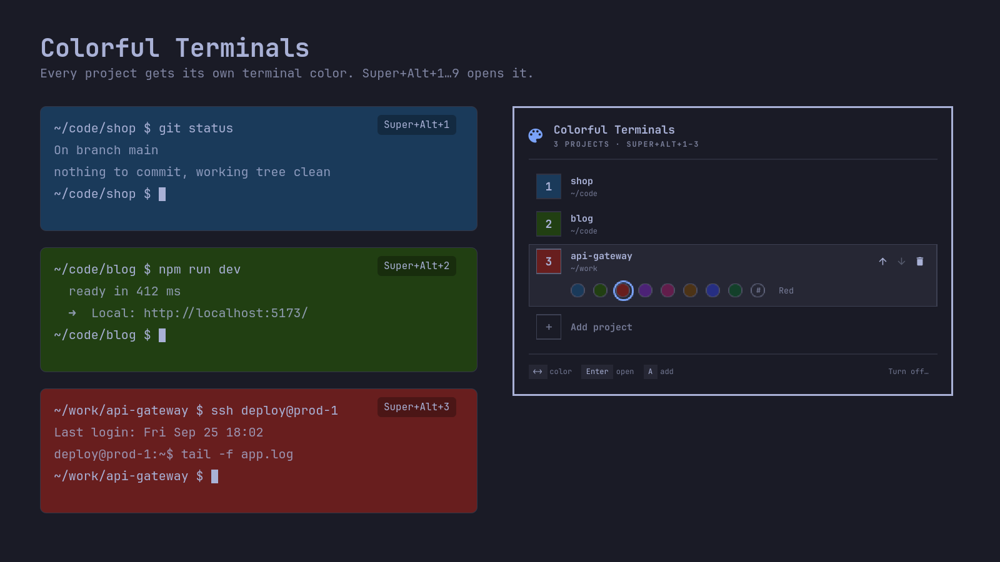

# Colorful Terminals for Omarchy: a terminal background color per project

[](https://github.com/andreiyurik/omarchy-colorful-terminals/actions/workflows/tests.yml)
[](https://omarchy.org/)
[](LICENSE)

Colorful Terminals is an [Omarchy](https://omarchy.org/) plugin that gives every project folder its own terminal background color, so you always know which project a terminal belongs to. `cd` into a project and the terminal turns its color. `Super+Ctrl+Alt+1…9` opens a project in a new terminal or jumps to its open window.

It works in Ghostty, Kitty, Alacritty and foot, in bash, zsh and fish, inside tmux, on Hyprland, and alongside any project launcher. The settings live in one small panel in the Omarchy shell.



## Why color terminals by project

With five or ten terminals open on Hyprland they all look the same, and the wrong `git push` or `rm` ends up in the wrong project. A color you see at a glance is faster than reading a prompt or a window title. Colorful Terminals keys the color off the folder, not off how the terminal was opened, so it works with Project Launcher, Tableau, a tmux sessionizer, or a plain `cd`.

## Features

- **Automatic.** `cd` into a project and the background turns its color. Leave it and the theme color comes back. Subfolders keep the project color; a project inside another project keeps its own.
- **Project hotkeys.** `Super+Ctrl+Alt+1…9` opens project 1…9 in a terminal, or jumps to its window if one is already open. The panel shows each project's key under its name, and Omarchy's keybindings list (`Super+K`) shows them all.
- **No conflicts with Omarchy.** Every other `Super`+digit combination is Omarchy's own (workspaces, moving windows, bar panels, group tabs). The plugin never takes a key of Omarchy's, and the panel tells you if one of your own bindings shares a key.
- **A color for any terminal.** `Super+Ctrl+Alt+Shift+1…8` gives the terminal you are in one of eight colors, project or not; `Super+Ctrl+Alt+Shift+0` takes it away.
- **Readable on every theme.** Eight dark colors picked for light text on Omarchy's dark themes, and a light palette for light themes. The panel marks a color that is hard to read on your theme.
- **One small panel.** Add folders, pick colors, reorder, with the keyboard or the mouse. Every change is saved as you make it, to a plain text file you can also edit by hand.
- **Honest about what it changes.** Nothing changes until you choose **Turn on**, the panel lists every file first, backups are saved, and **Turn off** gives each file back exactly as it was. No sudo, no network.

## Install

```bash
omarchy plugin add https://github.com/andreiyurik/omarchy-colorful-terminals --enable
```

Then click the palette icon (󰏘) on the right of the bar.

1. Pick a folder: **Enter** adds the one you are in, or type to search your git repositories.
2. Choose **Turn on**. The panel lists the files it adds a block to, and **Show exact lines** shows every line first (see [What it changes](#what-it-changes)). Nothing changes before this.
3. Press **Enter** to open your first project in a new terminal, in its color.

After that, the bar icon, `Super+Ctrl+Alt+0`, or **Omarchy menu › Style › Colorful Terminals** opens the panel. To move the icon: `omarchy bar move andreiyurik.colorful-terminals --section left`. Without the icon, `omarchy-shell shell toggle andreiyurik.colorful-terminals '{}'` opens it too.

To update: `omarchy plugin update andreiyurik.colorful-terminals`, then `omarchy restart shell` so the new panel shows. (The shell reloads a plugin's entry file on its own, but keeps parts it has already loaded until it restarts.)

## Usage

### Hotkeys

| Keys | What it does |
|---|---|
| `Super+Ctrl+Alt+1` … `Super+Ctrl+Alt+9` | Open project N, or jump to its open window |
| `Super+Ctrl+Alt+0` | Open the settings panel |
| `Super+Ctrl+Alt+Shift+1` … `Super+Ctrl+Alt+Shift+8` | Give the terminal you are in color 1…8 |
| `Super+Ctrl+Alt+Shift+0` | Take that color away: back to the project or theme color |

Omarchy's own keybindings list (`Super+K`) shows them all, each project key with its folder name and each color key with its color.

A color from `Super+Ctrl+Alt+Shift` belongs to that one terminal. It stays when you `cd` into a project and goes away with `Super+Ctrl+Alt+Shift+0` or when the terminal closes. It is always the terminal you are in, even when one terminal program draws all your windows, because the shell in that terminal does the coloring: Hyprland passes the key to the focused window. So it works at a shell prompt; if a program is running there, a notification says so and nothing changes.

### In the panel

| Keys | What it does |
|---|---|
| `↑` `↓` | Move between projects |
| `←` `→` | Change the project's color |
| `C` or `#` | Type a custom color, like `#1a3a5a`, with a live preview |
| `Shift+↑` `Shift+↓` | Move it up or down; this changes its key number |
| `Enter` | Open the project |
| `Del` | Remove it (**Undo** or `Ctrl+Z` puts it back) |
| `A` | Add a project (`Tab` completes a path) |
| `Ctrl+U` | Turn off, after asking |
| `Esc` | Close |

On the **Any terminal** row: `←` `→` go from key to key, `Shift+←` `Shift+→` change that key's color, `C` types a custom one, and `Del` puts it back to the palette color. A click on a tile does the same.

The bottom of the panel shows the few keys that matter for what is selected, and the buttons show theirs on hover. Everything also works with the mouse. Letter keys go by position, so they work on any keyboard layout, and the folder field understands a path typed on a Russian layout (`Ё.` is `~/`).

## Configure

Everything lives in one file you can also edit by hand:
`~/.config/colorful-terminals/projects.conf`. The panel picks up your edits
while it is open, and new prompts use them right away.

```
# folder                color
~/code/shop             #1a3a5a
~/code/blog             #213f12     # anything after " # " is a comment
~/work/api-gateway      #681e1e
```

The first project line opens with `Super+Ctrl+Alt+1`, the second with `Super+Ctrl+Alt+2`, and so on. You can have more than nine projects: the rest get colors but no key. A `replace-group-keys` line from versions before 0.5 does nothing now and can be deleted.

Colors you change for the `Super+Ctrl+Alt+Shift` keys are kept in the same file, one line per key:

```
paint-3 = #5a1a3a
```

A key without a line uses the palette color in its place, dark or light to match your theme.

## What it changes

The plugin itself only lives in `~/.config/omarchy/plugins/andreiyurik.colorful-terminals/`. To work, it adds one marked block to each of these files, and only after you choose **Turn on** in the panel:

| File | What the block does |
|---|---|
| `~/.bashrc` | Sources the hook that sets the terminal color before each prompt |
| `~/.zshrc` | The same for zsh, only if zsh is installed and you use it |
| `~/.config/fish/conf.d/colorful-terminals.fish` | The same for fish, in a file of its own, only if fish is installed and you use it |
| `~/.config/hypr/hyprland.lua` | Loads the `Super+Ctrl+Alt+0…9` and `Super+Ctrl+Alt+Shift+0…8` keys |
| `~/.config/omarchy/extensions/omarchy-menu.jsonc` | Adds **Style › Colorful Terminals** to the Omarchy menu |

Each block starts with `BEGIN colorful-terminals` and ends with `END colorful-terminals`. Before changing a file, the plugin saves a copy to `~/.config/colorful-terminals/backup/`. A symlinked `~/.bashrc` stays a symlink.

The keys are `Super+Ctrl+Alt` because every other `Super`+digit combination is Omarchy's: workspaces, moving windows, bar panels, and group tabs on `Super+Alt`. So the plugin never takes a key of Omarchy's. If you bind something of your own to a `Super+Ctrl+Alt`+digit or `Super+Ctrl+Alt+Shift`+digit, the panel says so. Nothing needs sudo, nothing goes over the network, and nothing is collected.

## Remove

1. In the panel, choose **Turn off…** (or press `Ctrl+U`) and confirm. This removes the blocks and gives each file back exactly as it was (any edits you made since are kept). The same thing from a terminal:

   ```bash
   ~/.config/omarchy/plugins/andreiyurik.colorful-terminals/bin/colorful-terminals integration uninstall
   ```

2. Remove the plugin:

   ```bash
   omarchy plugin remove andreiyurik.colorful-terminals
   ```

Your project list and the backups stay in `~/.config/colorful-terminals/`. Delete that folder if you do not want them. If you remove the plugin first, the blocks stay behind but do nothing; delete the lines between the `BEGIN` and `END` markers by hand.

## Limitations

- **The color changes at the next prompt.** It switches when a command finishes and the shell draws its prompt, not in the middle of a running script. The same goes for a theme switch: a terminal that reloads its config is back in its color at the next prompt.
- **bash, zsh and fish**, in terminals that support the standard OSC 11 background code: Ghostty, Kitty, Alacritty and foot all do. Inside tmux the tmux pane takes the color instead. Not inside zellij.
- **Terminals opened before you turn it on** get colors once you open them again; their shell has not loaded the hook yet.
- **The `Super+Ctrl+Alt+Shift` keys work at a shell prompt.** While a program runs in the terminal (an editor, `btop`, `ssh`), the shell cannot answer, so the color stays and a notification says why.
- **Light themes get a light palette.** Colors picked on a dark theme are marked on a light one, so you can pick a light color instead.
- A program that paints its own background, such as a full-screen editor theme, covers the color while it runs.
- Folder names containing ` # ` (space, hash, space) or line breaks are not supported.

## FAQ

### How do I change the terminal background color per directory on Omarchy?

Install the plugin and add the folder in the panel. The shell hook sends the standard OSC 11 escape code whenever you enter that folder, and OSC 111 to restore the theme color when you leave. Inside tmux it sets the pane's style instead, so each pane keeps its own color.

### Does it work with Ghostty, Kitty, Alacritty and foot?

Yes. Ghostty is Omarchy's default terminal; Kitty, Alacritty and foot work the same way, because all four support OSC 11. Any other terminal that supports OSC 11 works too.

### Does it work with zsh, fish and tmux?

Yes. The hook is written for bash, zsh and fish, and each is tested on Arch, Ubuntu, Debian and Fedora. Inside tmux each pane gets its own color, in all three shells.

### Does it conflict with Omarchy's keybindings?

No. Omarchy uses `Super`, `Super+Shift`, `Super+Shift+Alt`, `Super+Ctrl` and `Super+Alt` with the digit keys; the plugin uses `Super+Ctrl+Alt` and `Super+Ctrl+Alt+Shift`, which Omarchy leaves free. The panel warns if one of your own bindings shares a key, and the release test checks every Omarchy key is untouched.

### Can I tell projects apart at a glance in Hyprland?

Yes: every project terminal has its own color, and its window gets the app id `org.omarchy.project_<name>`, so `Super+Ctrl+Alt+N` finds it again instead of opening a second one.

### Does it need a project launcher?

No, and it works alongside one. The color depends only on the current folder.

### Is it safe? What does it change on my system?

It adds one marked block to `~/.bashrc` (and `~/.zshrc` or fish's `conf.d` if you use those shells), to `~/.config/hypr/hyprland.lua` and to the Omarchy menu extension file, and only after you choose **Turn on**. Each file is backed up first and **Turn off** restores it byte for byte. Nothing needs sudo, nothing goes over the network. See [What it changes](#what-it-changes).

### How do I pick a color that reads well on my theme?

The eight palette colors are dark enough for light text on every stock Omarchy theme, and the light palette does the same for light themes. If you type a custom color, the panel marks it when the theme's text would be hard to read on it or when it looks the same as the theme background.

## Development

```bash
tests/run              # every test, in a temporary HOME
tests/render-panel out # screenshots of the panel in each state (at 2x)
tests/render-preview   # regenerate preview.png
tests/distros/run      # bash, zsh, fish and tmux on Arch, Ubuntu, Debian and Fedora (docker)
tests/omarchy/run      # the panel on Omarchy's latest release and its default branch (docker)
tests/release-vm/run   # before a release: the plugin in a real Omarchy, in QEMU (docker, KVM)
```

The tests never touch your real `~/.bashrc`, `~/.zshrc` or `~/.config`. `tests/distros/run` runs the shell tests in a container per distribution, with each one's own shells and system shell config, as a normal user and without network; CI runs it for all four. `tests/omarchy/run` renders the panel on Omarchy's own shell code, fetched from GitHub: the latest release and the default branch. CI runs it on every push and once a day, so a change in Omarchy that breaks the panel is caught before a release reaches users.

Before a release, `tests/release-vm/run` installs the real Omarchy ISO in a QEMU/KVM virtual machine and goes through the plugin the way a user does: `omarchy plugin add`, the bar icon and the panel, Turn on, `Super+Ctrl+Alt+1` pressed on a virtual keyboard, the project terminal and its color in Ghostty, `Super+Ctrl+Alt+0`, `omarchy plugin update`, Turn off (every file back byte for byte), and `omarchy plugin remove`. QEMU runs in a container, so nothing is installed on your machine. The first run downloads the 6 GB ISO and installs Omarchy, up to 40 minutes; the installed system is cached and later runs take minutes. Screenshots land in `tests/release-vm/out/`.

A release is tagged only when all three are green: `tests/run` with CI (every push), `tests/omarchy/run` (every push and daily), and `tests/release-vm/run` (before the tag). The hook tests use zsh, fish and tmux when they are installed (`CT_ZSH` and `CT_FISH` point at other binaries) and skip them otherwise.

## License

[MIT](LICENSE)
